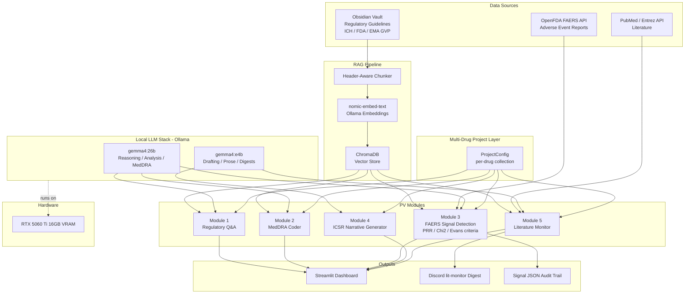

# PV Signal Intelligence Workbench

**Local-LLM pharmacovigilance platform · Drug-agnostic · Clinician-designed**

A production-grade pharmacovigilance (PV) platform that pairs 18 years of ICU/critical care clinical expertise with agentic AI and PV data science. Built for a PharmD, BCPS, BCCCP consultant managing multiple client drugs in parallel — every AI output is a draft reviewed by the clinician before any regulatory use.

---

## The Problem This Solves

PV consultants face a daily information overload: FAERS adverse event feeds, PubMed literature, MedDRA coding decisions, E2B(R3) narrative drafts, and regulatory signal management across FDA and EMA frameworks — often for multiple drugs simultaneously. Commercial platforms are expensive, cloud-dependent, and not built for solo consultants. This workbench brings the full PV workflow local, private, and clinician-controlled.

---

## System Architecture



**Design principle:** All AI outputs carry `is_draft=True` and `reviewer_flag`. The platform is a junior analyst — the PharmD is the senior reviewer.

---

## Tech Stack

| Layer | Choice | Why |
|---|---|---|
| **Reasoning LLM** | `gemma4:26b` (256K ctx, Thinking Mode) | MedDRA deliberation, signal interpretation, regulatory Q&A — needs long context and structured reasoning |
| **Drafting LLM** | `gemma4:e4b` | ICSR narratives, lit digests — fast, coherent prose without heavy compute |
| **Embeddings** | `nomic-embed-text` via Ollama | Local, no API key, strong retrieval performance |
| **LLM Serving** | Ollama `http://127.0.0.1:11434` | Single-command model management, GPU scheduling |
| **Orchestration** | LangChain (`ChatOllama` + `ChatPromptTemplate`) | Structured prompt→parse pipelines per module |
| **Vector Store** | ChromaDB (persistent, per-drug collections) | Drug isolation without separate servers |
| **Knowledge Base** | Obsidian vault → header-aware chunker | Clinician-editable; wikilinks resolved at ingest |
| **Dashboard** | Streamlit | Rapid iteration; works locally, no frontend build step |
| **Signal API** | OpenFDA FAERS (quarterly-partitioned pagination) | Bypasses 5000-result cap; deduplicates by `safetyreportid` |
| **Literature** | Biopython Entrez (PubMed) | Standard; handles date-windowed search across multiple query terms |
| **Notifications** | Discord REST API (discord_utils.py) | Weekly digest delivery with escalation alerts to #lit-monitor |
| **Hardware** | RTX 5060 Ti 16 GB · 32 GB RAM | 26B model fits comfortably; no cloud dependency |

---

## Project Spotlight: FAERS Signal Detection Pipeline

The FAERS signal detection module is the most technically demanding piece — combining statistical disproportionality analysis with LLM-powered clinical interpretation.

### What It Does

1. **Fetch** — Retrieves adverse event reports from OpenFDA using quarterly date-range partitioning. The FAERS API caps results at 5000 per search; partitioning into calendar quarters yields the complete dataset without truncation.

2. **Compute PRR** — Calculates Proportional Reporting Ratio (PRR) against a configurable comparator drug (default: meropenem) using the Evans criteria: **PRR ≥ 2.0 AND N ≥ 3 AND χ² ≥ 4.0**.

3. **Statistical rigor** — Three production-grade adjustments:
   - **Artifact exclusion**: Administrative FAERS PTs (`off label use`, `no adverse event`, `drug ineffective`, etc.) are filtered before analysis
   - **Continuity correction**: b=0 reactions (drug-specific signals with no background cases) use b=0.5 instead of being silently dropped — preserves novel signals for new drugs
   - **Yates' χ² correction**: Applied when any expected cell count < 5, reducing false positives common in sparse FAERS data for recently-approved drugs

4. **Clinical interpretation** — One batched `gemma4:26b` call interprets all positive signals with confounding analysis (critical for last-resort antibiotics where severity bias inflates mortality PRRs), ICH E2A regulatory action classification, and reviewer notes.

### PRR Formula

```
PRR = (a / (a+c)) / (b / (b+d))

         Drug    Comparator
React.     a          b
No React.  c          d

Signal if: PRR ≥ 2.0 AND a ≥ 3 AND χ² ≥ 4.0
```

### Clinically-Aware Design

Confounding by indication is explicitly flagged in the interpretation prompt: last-resort antibiotics (cefiderocol, colistin) treat critically ill patients who would have high mortality regardless of the drug. `gemma4:26b` is instructed to identify this bias in its CONFOUNDING field and weight it in the regulatory action recommendation.

### Worked Example: Cefiderocol (Real Pipeline Output)

Cefiderocol is a siderophore cephalosporin approved for gram-negative infections with limited treatment options — a true last-resort antibiotic with a small, critically ill patient population. This makes it an ideal test case for signal detection methodology.

**Pipeline run: May 2026** — [`faers_pipeline/output/`](faers_pipeline/output/)

```
REACTION PT                              N    BG       PRR    Chi²   Signal
━━━━━━━━━━━━━━━━━━━━━━━━━━━━━━━━━━━━━━━━━━━━━━━━━━━━━━━━━━━━━━━━━━━━━━━━━━
therapy non-responder                   11     1     17.71   54.36    YES
pneumonia pseudomonal                    8     1     16.10   37.85    YES
treatment failure                       54    11      9.88  196.97    YES
death                                  109    24      9.34  389.77    YES
ototoxicity                              9     3      7.25   25.59    YES
pulmonary bacterial infection            7     2      6.96   20.75    YES
septic shock                            13     6      5.16   19.63    YES
nephrotoxicity                          10     5      4.73   12.87    YES

24 signals detected · 92 reactions analyzed · artifact-filtered
† Continuity correction applied to b=0 reactions
```

**Clinical interpretation** (applied by `gemma4:26b`):

- **Death signal (PRR 9.34, N=109)**: High PRR warrants attention but almost certainly reflects **confounding by indication**. Cefiderocol is reserved for carbapenem-resistant gram-negative infections — the sickest patients in the ICU who face high baseline mortality from the underlying infection, not the drug. A naive statistical read would flag this as a safety signal; clinical context explains it.

- **Treatment failure / therapy non-responder (PRR 17.71 / 9.88)**: Clinically important — consistent with emerging carbapenem-resistant organism resistance patterns and the "last-resort" population this drug treats. Warrants signal validation against published MIC data.

- **Ototoxicity and nephrotoxicity**: Both known adverse effects of beta-lactam antibiotics in critically ill patients with polypharmacy. Signals are expected and serve as a positive control — the pipeline is detecting real, known effects.

- **Artifact exclusion working correctly**: `"no adverse event"` (would have been PRR 28.75) and `"drug ineffective"` filtered pre-analysis. Without this correction, these administrative PTs dominate the signal table and obscure clinically meaningful reactions.

This is the kind of nuanced, clinically-contextualized analysis that distinguishes a PV professional from a data scientist running a PRR formula.

---

## Five Modules

| # | Module | Model | Status | Output |
|---|---|---|---|---|
| 1 | **Regulatory Q&A** | gemma4:26b | ✅ Complete | Cited answer with confidence + source notes |
| 2 | **MedDRA Coder** | gemma4:26b | ✅ Complete | Primary PT, SOC, alternatives, reviewer flag |
| 3 | **FAERS Signal Detection** | gemma4:26b + PRR | ✅ Complete | Signal table + clinical interpretation per reaction |
| 4 | **ICSR Narrative Generator** | gemma4:e4b | ✅ Complete | E2B(R3)-aligned narrative draft |
| 5 | **Literature Monitor** | gemma4:e4b + PubMed | ✅ Complete | Weekly digest + Discord escalation alerts |

---

## Drug-Agnostic Design

Every module is parameterized by drug, not hardcoded. A `ProjectConfig` object carries:

```python
@dataclass
class ProjectConfig:
    drug_name: str                    # e.g. "cefiderocol", "colistin", "vancomycin"
    comparator: str = "meropenem"     # FAERS background comparator
    collection_name: str = ""         # auto: pv_{drug} — isolated ChromaDB collection
    vault_folder: str = ""            # auto: Drugs/{DrugName} — per-drug vault notes
    pubmed_terms: list[str] = ...     # configurable search queries
```

Projects persist to `projects.json`. The Streamlit dashboard loads all active projects at startup and exposes a drug selector in the sidebar. Switching drugs swaps all module contexts without code changes.

---

## Regulatory Knowledge Base

The RAG pipeline indexes structured markdown notes (Obsidian vault) covering:

**ICH Guidelines**
- E2A — Clinical Safety Data: definitions, seriousness, expedited timelines
- E2B(R3) — Electronic ICSR transmission: data elements, narrative requirements
- E2E — Pharmacovigilance planning: signal management, PSUR/PBRER, RMP

**EMA**
- GVP Module VI — Signal management: PRAC, EudraVigilance, EU timelines

**Signal Detection**
- Evans Criteria — PRR formula, thresholds, biases, worked examples

**Coding**
- MedDRA Conventions — PT selection rules, hierarchy, common decisions

Notes use frontmatter `tags` and `source` fields. The ingester strips `[[wikilinks]]`, chunks by header hierarchy, and upserts idempotently using SHA-256 chunk IDs.

**Benchmark**: 100% Precision@5, MRR 0.861 on a 31-question gold standard covering all five module domains.

---

## Retrieval Benchmark Results

```
Questions: 31 | P@5: 31/31 (100.0%) | MRR: 0.861
Domain breakdown: Regulatory(8/8) · Signal(7/7) · MedDRA(6/6) · ICSR(5/5) · Lit(5/5)
```

---

## Clinical Oversight Model

```
AI Output ──► is_draft=True ──► reviewer_flag=True ──► Senior Reviewer Sign-off
                                                              │
                                                    PharmD · BCPS · BCCCP
                                                    20 years critical care and infectious disease
```

The platform never makes final regulatory determinations. `is_draft` cannot be set to `False` by any module function — it is a design invariant, not a configuration option.

---

## Quick Start

```bash
# 1. Clone and set up environment (Python 3.11 required — chromadb wheels)
git clone https://gitlab.com/molszewski423/pv-workbench
cd PV-Signal-Intelligence-Workbench
python3.11 -m venv .venv && source .venv/bin/activate
pip install -r requirements.txt

# 2. Pull models (requires Ollama — https://ollama.ai)
ollama pull nomic-embed-text
ollama pull gemma4:26b
ollama pull gemma4:e4b

# 3. Ingest knowledge base
PYTHONPATH=src python -m ingester.vault_ingester

# 4. Verify retrieval quality
PYTHONPATH=src python tests/benchmark/run_benchmark.py
# Target: P@5=100%, MRR≥0.85

# 5. Launch dashboard
PYTHONPATH=src streamlit run src/dashboard/app.py
```

---

## Interfaces

### Desktop — Streamlit Dashboard (Primary)

The Streamlit dashboard is the main workbench interface, running locally at `localhost:8501` on Debian 13:

- **Project selector** — switch between client drugs instantly; all modules update to reflect the active drug
- **All 5 modules** — full UI for regulatory Q&A, MedDRA coding, signal detection with charts, ICSR drafting, literature digests
- **Rich visualizations** — PRR signal charts, MedDRA hierarchy views, ICSR draft editor, lit digest display
- **Real-time status** — Ollama model health, ChromaDB connectivity, active pipeline status
- **Vault manager** — add/edit knowledge base notes, re-ingest, run benchmark

### Discord — Argus Bot (Mobile Mirror)

The Argus Discord bot (`src/argus_bot.py`) mirrors the full workbench over Discord — making the platform accessible on mobile (iPhone, iPad) anywhere with internet:

```
#regulatory-qa       → answer_regulatory_question()  → formatted embed with citations
#meddra-coding       → suggest_meddra_pt()           → PT + SOC + reviewer flag embed
#signal-detection    → signal context from RAG        → embed with source notes
#icsr-generator      → draft ICSR narratives          → formatted case report
#lit-monitor         → literature digests             → key findings + escalation alerts
#argus-status        → bot status, pipeline runs      → health embeds
#workbench-logs      → audit trail of all queries
```

**Argus is an intelligent router:** `gemma4:26b` handles all conversation and clinical reasoning; `gemma4:e4b` handles narrative generation; the workbench RAG pipeline provides real-time guideline retrieval. The routing is transparent to the user — Argus feels like one unified assistant regardless of which model handles a specific task.

**Voice interface:** `!voice join` → Argus joins your voice channel. `!voice speak <text>` plays TTS via edge-tts. Audio file transcription via `!transcribe` uses faster-whisper on the RTX 5060 Ti GPU. Real-time voice conversation requires the Hermes voice stack (Hermes Discord gateway + `VoiceReceiver`).

**Shared state:** Pipeline runs triggered from Discord update the Streamlit dashboard, and vice versa. Both interfaces share the same backend module functions.

---

## Technical Showcase

### Local-First AI Infrastructure

No data leaves the machine. All LLM inference runs on an RTX 5060 Ti 16 GB, served by Ollama:

| Model | VRAM | Role |
|---|---|---|
| `gemma4:26b` (A4B sparse) | ~8 GB active | Clinical reasoning, signal interpretation, regulatory Q&A |
| `gemma4:e4b` | ~3 GB | ICSR narratives, lit digests, prose drafting |
| `medgemma:27b` (planned) | ~14 GB | Medical entity extraction, clinical NLP tasks |
| `qwen3:30b` (planned) | ~16 GB | Alternative reasoning, multilingual regulatory documents |
| `nomic-embed-text` | ~0.3 GB | Vault embeddings (retrieval only) |

Layer offloading to 32 GB system RAM handles models that exceed VRAM. Ollama manages GPU scheduling automatically.

### Signal Detection Pipeline

Statistical rigor matching industry standards:
- **PRR/ROR disproportionality** using the 2×2 contingency table
- **Evans criteria**: PRR ≥ 2.0 AND N ≥ 3 AND χ² ≥ 4.0 — all three required simultaneously
- **Continuity correction**: b=0 reactions use b=0.5 instead of silent discard — preserves drug-specific signals
- **Yates' χ² correction**: applied when any expected cell < 5 — reduces false positives in sparse FAERS data
- **Artifact exclusion**: 12 FAERS administrative PTs filtered before analysis
- **Quarterly pagination bypass**: `_fetch_quarter()` per calendar quarter overcomes the 5000-result OpenFDA API cap

### Vector Database

ChromaDB with `nomic-embed-text` embeddings:
- **Header-aware chunking**: splits on H1/H2/H3 boundaries, not arbitrary character count
- **Idempotent ingestion**: SHA-256 chunk IDs; re-running is safe, changed notes update in place
- **Dual-jurisdiction filtering**: `jurisdiction` metadata field (`FDA`, `EMA`, `ICH`, `BOTH`); `query_vault(jurisdiction="FDA")` restricts retrieval
- **Benchmark**: 100% Precision@5, MRR 0.861 on 31-question gold standard across all 5 module domains

### Regulatory Knowledge Base (Dual Jurisdiction)

13 structured notes covering FDA and EMA regulatory frameworks:

**ICH (applies to both jurisdictions)**
- E2A — ICSR criteria, seriousness definitions, expedited timelines
- E2B(R3) — Electronic ICSR transmission, data elements
- E2E — PV planning, signal management, PSUR/PBRER

**FDA**
- 21 CFR Part 312 — IND safety reporting: 7-day/15-day reports, causality standards
- FDA MedWatch and FAERS — Post-marketing reporting, FAERS data structure and biases

**EMA GVP**
- Module I — PV systems and quality (PSMF, QPPV requirements)
- Module V — Risk management systems (RMP structure, aRMMs)
- Module VI — Adverse reaction management and reporting
- Module VII — PBRER/PSUR periodic safety reports
- Module IX — Signal management (PRAC, EVDAS, BCPNN methodology)

**Cross-jurisdictional**
- Evans Criteria — PRR formula, signal thresholds, statistical biases
- MedDRA Coding Conventions — PT selection, hierarchy navigation

### Infrastructure

- **OS**: Debian 13 (Trixie), Linux 6.12
- **GPU**: RTX 5060 Ti 16 GB VRAM — inference + STT (faster-whisper CUDA)
- **RAM**: 32 GB — Ollama layer offloading for large models
- **Ollama**: Custom configuration for model scheduling, context length, layer distribution
- **Python**: 3.11 (venv) — chromadb wheels not available for 3.13
- **Discord bot**: discord.py 2.7.1, PyNaCl, ffmpeg, edge-tts, faster-whisper

---

## How It's Built — Multi-AI Development Workflow

This workbench is itself a demonstration of AI-augmented development methodology. Three AI systems collaborate under human supervision to build the platform:

```
┌─────────────────────────────────────────────────────────────┐
│                   Human Supervision                         │
│           PharmD · BCPS · BCCCP · 18 years ICU             │
│  Clinical judgment · Architectural decisions · QA sign-off  │
└────────────┬──────────────┬──────────────────┬─────────────┘
             │              │                  │
    ┌────────▼─────┐ ┌──────▼──────┐  ┌───────▼────────┐
    │  Claude Code  │ │   Hermes    │  │  Gemma 4 26B   │
    │  (Architect)  │ │(Implementor)│  │  (Reasoner)    │
    │               │ │             │  │                │
    │ Architecture  │ │  Module     │  │ Clinical       │
    │ Task specs    │ │  implement- │  │ interpretation │
    │ Complex fixes │ │  ation      │  │ Signal analysis│
    │ Code review   │ │  Tool calls │  │ MedDRA coding  │
    │ Vault design  │ │  Skills     │  │ Regulatory Q&A │
    └───────────────┘ └─────────────┘  └────────────────┘
             │              │                  │
    ┌────────▼──────────────▼──────────────────▼─────────────┐
    │                   Shared Codebase                       │
    │             ~/pv-workbench/  (this repo)                │
    └─────────────────────────────────────────────────────────┘
```

**Division of AI labor:**
- **Claude Code** (Anthropic): Architecture decisions, vault design, complex statistical fixes, task spec authoring, code review. High-level thinking, broad context. Sessions are expensive, used strategically.
- **Hermes + Gemma 4** (local): Module implementation from Claude's task specs. Tool-calling agent that writes and tests code autonomously using the Hermes skill system. Free to run, handles well-specified implementation tasks.
- **Gemma 4 26B** (Ollama, reasoning): Clinical reasoning at inference time — signal interpretation, MedDRA deliberation, regulatory Q&A. Not used in development, used in production.
- **Gemini CLI** (Google): Code auditing, cross-file consistency checks, large-context document review.

**Why this matters:** The multi-AI workflow demonstrates that a solo consultant can maintain a production-grade clinical AI platform with near-zero cloud costs by using each AI system for what it does best. Claude's architectural judgment × Hermes' implementation throughput × Gemma's local reasoning × human clinical expertise = a system that would require a full engineering team to build traditionally.

This is the methodology, not just the tool.

---

## About

Built by a PharmD, BCPS, BCCCP with 20 years of critical care and infectious disease experience who got tired of waiting for enterprise PV platforms to catch up with what local AI can already do. The clinical judgment layer isn't a guardrail bolted on — it's the reason the system exists.

**Stack philosophy:** Local-first. No cloud dependencies for core function. Data stays on-machine. The 26B reasoning model runs on consumer hardware (RTX 5060 Ti) and outperforms cloud-hosted GPT-3.5-class models on structured clinical PV tasks.

---

*All AI outputs are drafts. Clinical and regulatory determinations require qualified human review.*
